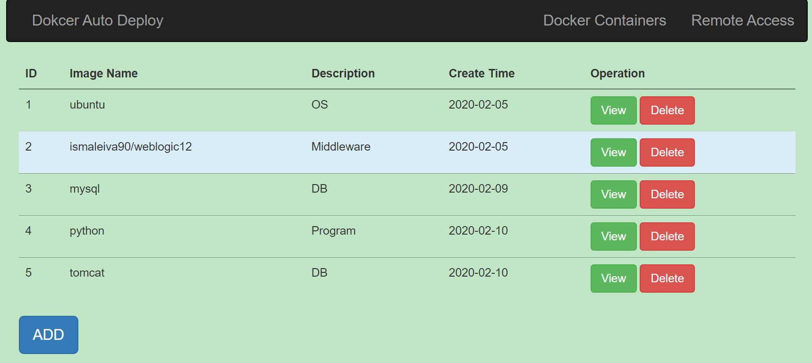
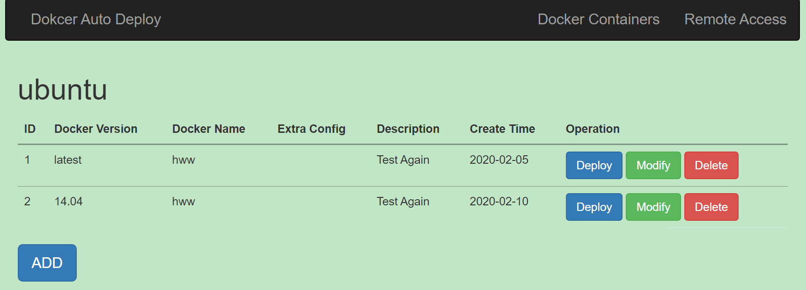
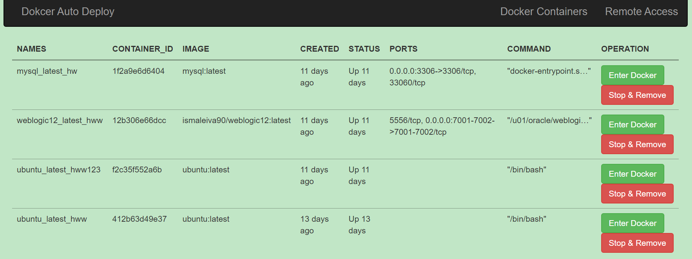
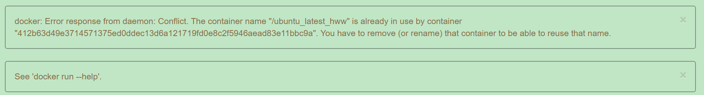
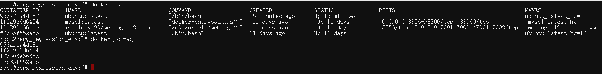

# DOCKER-AUTO-DEPLOY-WEBSITE

Created by Hanwen Liu during 2020 Spring Festival.

---

## Abstract

This auto-deploy website is a Flask APP.

It supports Linux and Windows.

## Deployment

This website is tested under `Python2` on `Linux 4.4.0`, `Ubuntu 16.04.2 LTS`, and `Win10`.

You can install all the requirements by the following code.

```
pip install requirements.txt
```

This website can be easily deployed by one single command.

```
python app.py
```

 The default port is set as 2020, and you can change to any other port by changing the code and the end of `app.py`.

```
app.run(host='0.0.0.0', port=2020, debug=True)
```

If you want the remote access to the host `VM`., you need `GoTTY`.

```
gotty -w /bin/bash
```

---

## Overview Pages

### Home Page

This page shows the supported docker images.

You can use the `ADD` button to create new environments. 

And for a specific environment, you can do operations such as `View` and `Delete`.



### Detail Page

This page shows the detailed versions of the chosen image.

To enter this page by clicking View Button in the Home Page.

You can `Deploy` the current list docker, or `Modify` as you need, or `Delete` this infromation from the database.

**Recommend:** `Docker Name` needs to change each time for specificity and easily found.



### Docker Page

This page will show after you `deploy` the docker image.

You can also enter this page directly from the top navigation bar.



If there are any problems appear in the process of deploying, it will show the error information(as shown in bash) by flash form. It shows like the following images:



If the deploy process is done, it will flash `Deploy Successfully`.

### Remote Access Page

`GoTTY` supports this remote access page.

You can directly interact with the host by this page. 

The default port is set as 8080.




## Another Important Supported Functions

1. Using the SQLite lightweight database stores the provided docker environment templates.
2. Free to set the Docker name and description for your deployment so that you can quickly find your own Docker Container.
3. The Docker instructions are encapsulated well as a single button, allowing you to operate directly and efficiently without mastering the inner execution and code of Docker.
4. The error detection mechanism can detect errors of duplicate names and ports. And it will prompt errors at the top of the page.
5. You can communicate with the host through GoTTY, which is a convenient and safe way for the host VM.